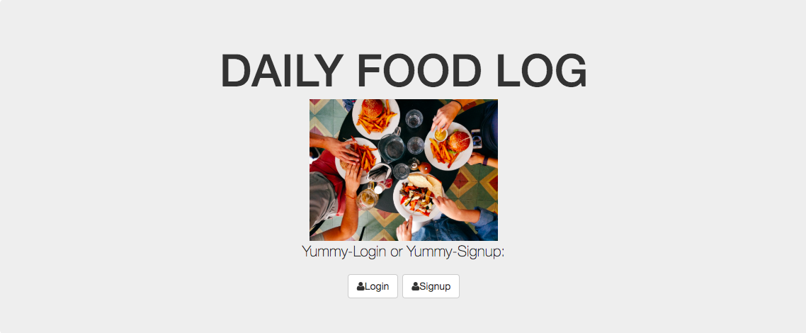

## DAILY FOOD LOG FULL STACK APPLICATION 

This is my first full stack application that I built that essentially gives the user the ability to sign in, sign up for an account and be able to log their food throughout the day and also an estimate for the calories as well.

TOOLS used: HTML, CSS, NODE JS, JAVASCRIPT, MONGODB, 

## Installation

1. Clone repo
2. run `npm install`

## Usage

1. run `node server.js`
2. Navigate to `localhost:8080`
